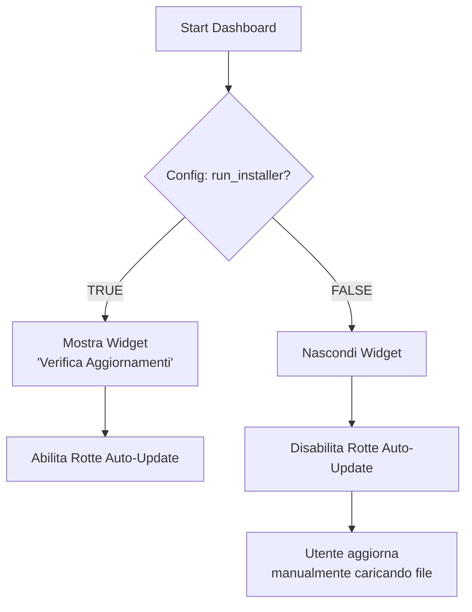
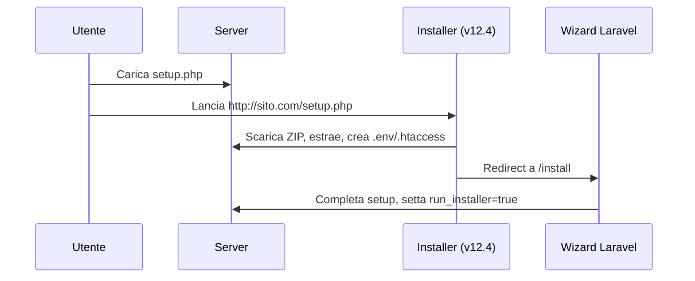
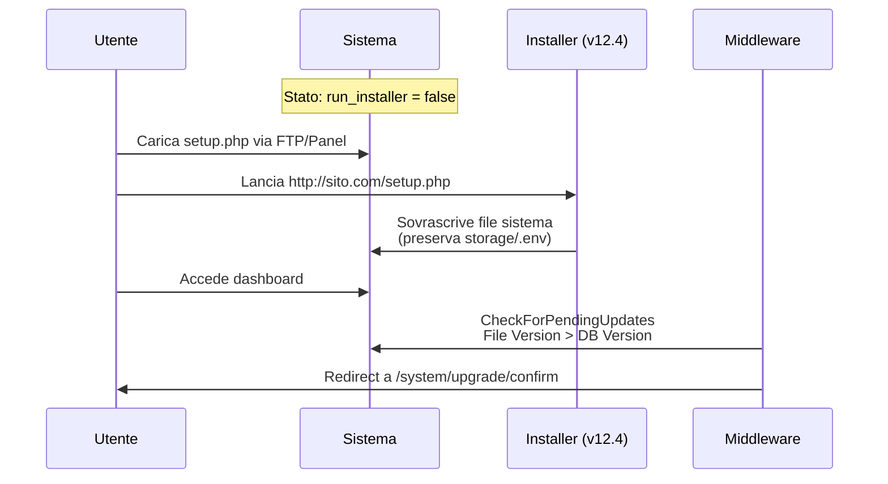
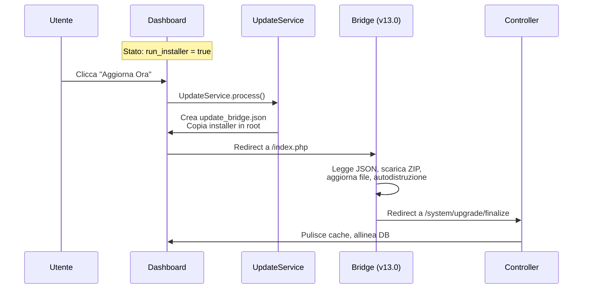
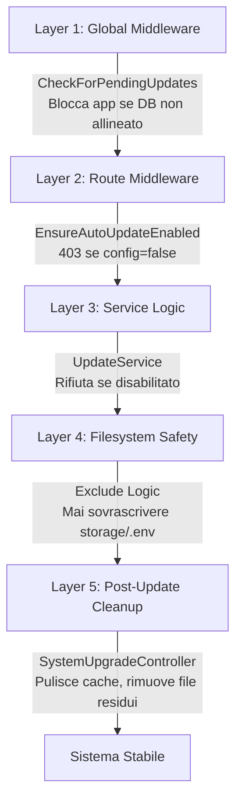

```markdown
# KondoManager Update System Bible

> **Architettura di aggiornamento automatico/manuale - Documentazione tecnica completa**

| Metadata | Value |
|----------|-------|
| **Versione Architettura** | 1.8.0-RC |
| **Ultima Modifica** | 01 Febbraio 2026 |
| **Stato** | Production |
| **Autori** | KondoManager Dev Team |

---

## Indice

1.  [Il Cuore Logico](#1-il-cuore-logico-wizard-vs-manuale)
2.  [Scenari Operativi](#2-scenari-operativi)
3.  [L'Arsenale (File System)](#3-larsenale-file-system)
4.  [I 5 Livelli di Protezione](#4-i-5-livelli-di-protezione-)
5.  [Checklist di Rilascio](#5-checklist-di-rilascio-production)
6.  [Risoluzione Problemi](#6-risoluzione-problemi)

---

## 1. Il Cuore Logico (Wizard vs Manuale)

Il sistema decide se abilitare gli aggiornamenti automatici basandosi su una singola variabile di configurazione in `config/installer.php`.

### Diagramma Decisionale



### Tabella dei Comportamenti

| Tipo Installazione | Config (`installer.run_installer`) | Dashboard UI | Metodo Aggiornamento |
|-------------------|-----------------------------------|--------------|---------------------|
| **Via Wizard** | `true` | ✅ Bottone "Cerca Aggiornamenti" | Automatico (One-Click) |
| **Manuale (FTP)** | `false` | ❌ Nascosto | Manuale (Upload `setup.php`) |

---

## 2. Scenari Operativi

### SCENARIO 1: Nuovo Cliente (Fresh Install)



**Passaggi:**
1. **Azione:** Utente scarica `setup.php` (v12.4 Standalone) e lo carica sul server
2. **Esecuzione:** Lancia `http://sito.com/setup.php`
3. **Setup:** L'installer scarica lo ZIP, estrae, crea `.env` e `.htaccess`
4. **Redirect:** Porta l'utente a `/install`
5. **Risultato:** Laravel Wizard completa il setup e setta `run_installer = true`

### SCENARIO 2: Aggiornamento Manuale (1.7 → 1.8)

*Utile per hosting restrittivi o senza permessi CURL*



**Passaggi:**
1. **Stato:** Cliente ha `run_installer = false`
2. **Azione:** Utente carica `setup.php` (v12.4 Standalone) via FTP/Panel
3. **Esecuzione:** Lancia `http://sito.com/setup.php`
4. **Processo:** L'installer sovrascrive i file di sistema (preservando `storage` e `.env`)
5. **Middleware:** Al rientro in dashboard, `CheckForPendingUpdates` nota che `File Version > DB Version`
6. **Risultato:** Redirect forzato a `/system/upgrade/confirm` per lanciare le migrazioni

### SCENARIO 3: Aggiornamento Automatico (Bridge)



**Passaggi:**
1. **Stato:** Cliente ha `run_installer = true`
2. **Azione:** Clicca "Aggiorna Ora" in Dashboard
3. **Backend:** `UpdateService` crea `update_bridge.json` e copia l'installer interno in root
4. **Processo:** Redirect a `/index.php` (v13.0 Bridge)
5. **Esecuzione:** Il Bridge legge il JSON, scarica lo ZIP, aggiorna i file e si autodistrugge
6. **Risultato:** Redirect a `/system/upgrade/finalize`. Il controller pulisce la cache e allinea il DB

---

## 3. L'Arsenale (File System)

### Gli Installer (Frontend)

| Tipo | File | Posizione Repo | Scopo | Note |
|------|------|----------------|-------|------|
| **Standalone** | **v12.4** | `public/setup.php` | Nuovi Clienti / Manual Update | Hash Hardcoded. Grafica Premium. Crea .htaccess. |
| **Bridge** | **v13.0** | `resources/installer/index.php` | Auto-Update Interno | Hash dinamico (dal JSON). Minimalista. Git-Safe. |

### Il Backend (Laravel)

| Componente | File | Responsabilità |
|------------|------|----------------|
| **Service** | `app/Services/UpdateService.php` | Scarica JSON remoto, prepara il Bridge |
| **Controller** | `app/Http/Controllers/System/SystemUpgradeController.php` | Gestisce UI, Migrazioni (Retry Logic), Cleanup |
| **Middleware** | `app/Http/Middleware/EnsureAutoUpdateEnabled.php` | Protegge le rotte `/system/upgrade/*` |
| **Middleware** | `app/Http/Middleware/CheckForPendingUpdates.php` | Blocca l'app se il DB non è allineato ai file |

### ☁️ Il Cloud (Server Remoto)

| File | Contenuto | Esempio |
|------|-----------|---------|
| `packages/latest.json` | Versione, hash, url, requirements, exclude list | [Vedi esempio](#) |
| `packages/km_v1.8.0.zip` | Software completo (deve contenere `resources/installer/index.php`) | N/A |

**Esempio `latest.json`:**
```json
{
  "version": "1.8.0",
  "hash": "sha256:abc123...",
  "url": "https://updates.kondomanager.com/packages/km_v1.8.0.zip",
  "exclude": ["storage", ".env", "install.log", "update_bridge.json"],
  "requirements": {
    "php": "8.1",
    "laravel": "10.0"
  }
}
```

---

## 4. I 5 Livelli di Protezione 



### 1. **Livello 1 - Global Middleware**
```php
// File: app/Http/Middleware/CheckForPendingUpdates.php
public function handle($request, Closure $next)
{
    if ($this->needsDatabaseUpgrade()) {
        return redirect()->route('system.upgrade.confirm');
    }
    return $next($request);
}
```
*Controlla ogni richiesta HTTP. Se `File Version > DB Version` → STOP → Redirect.*

### 2. **Livello 2 - Route Middleware**
```php
// File: app/Http/Middleware/EnsureAutoUpdateEnabled.php
public function handle($request, Closure $next)
{
    if (!config('installer.run_installer')) {
        abort(403, 'Aggiornamento automatico disabilitato');
    }
    return $next($request);
}
```
*Protegge le rotte `/system/upgrade/*`. Se config è `false` → 403.*

### 3. **Livello 3 - Service Logic**
```php
// File: app/Services/UpdateService.php
public function prepareBridgeUpdate()
{
    if (!config('installer.run_installer')) {
        throw new UpdateDisabledException();
    }
    // ... procede con la creazione del bridge
}
```
*Logica interna. Rifiuta di generare il Bridge se la configurazione è disabilitata.*

### 4. **Livello 4 - Filesystem Safety**
*Entrambi gli installer (v12.4 e v13.0) rispettano:*
- Mai sovrascrivere `storage/`
- Mai sovrascrivere `public/uploads/`
- Mai sovrascrivere `.env` (tranne backup/restore)
- Rispettano la `exclude_list` dal `latest.json`

### 5. **Livello 5 - Post-Update Cleanup**
```php
// File: app/Http\Controllers\System\SystemUpgradeController.php
public function finalize()
{
    // 1. Pulisce cache orfane
    Artisan::call('cache:clear');
    
    // 2. Rimuove file installer residui
    $this->cleanupBridgeFiles();
    
    // 3. Ripara symlink storage se necessario
    $this->fixStorageSymlink();
    
    // 4. Invalida cache middleware
    $this->clearMiddlewareCache();
}
```

---

## 5. Checklist di Rilascio (Production)

> Copia questa checklist in ogni ticket di rilascio

### **Pre-Rilascio**
- [ ] **App Version:** `config/app.php` aggiornato alla nuova versione (es. `1.8.0-beta.4`)
- [ ] **Changelog:** Aggiornato `CHANGELOG.md` con tutte le modifiche
- [ ] **Database:** Verificate migrazioni e seeder (se presenti)

### **Creazione Pacchetto**
- [ ] **Bridge Check:** Verificato che `resources/installer/index.php` sia presente dentro lo ZIP
- [ ] **Hash ZIP:** Creato SHA256 dello ZIP e inserito in `latest.json`
- [ ] **Setup Standalone:** Aggiornate costanti `PACKAGE_HASH` e `PACKAGE_URL` in `public/setup.php`
- [ ] **Exclude List:** Verificato che `latest.json` abbia exclude list corretta
- [ ] **Requirements:** Aggiornati requisiti PHP/Laravel se necessari

### **Test**
- [ ] **Test Download:** Verificato che il link nel JSON sia pubblicamente accessibile
- [ ] **Test Hash:** Verificato che l'hash dello ZIP corrisponda
- [ ] **Scenario 1:** Testata installazione da zero
- [ ] **Scenario 2:** Testato aggiornamento manuale (config false)
- [ ] **Scenario 3:** Testato aggiornamento automatico (config true)
- [ ] **Rollback:** Testata procedura di rollback in caso di errore

### **Deploy**
- [ ] **Backup:** Backup completo del server remoto
- [ ] **Upload:** Caricato `km_vX.X.X.zip` sul server CDN
- [ ] **JSON Aggiornato:** Sostituito `latest.json` con la nuova versione
- [ ] **Monitoraggio:** Attivato logging per le prime 24 ore

---

## 6. Risoluzione Problemi

### Errori Comuni

| Problema | Causa Probabile | Soluzione |
|----------|-----------------|-----------|
| **"Hash mismatch"** | File ZIP corroto o hash errato nel JSON | Ricreare ZIP, ricalcolare hash, aggiornare `latest.json` |
| **Bridge non si autodistrugge** | Permessi filesystem | Verificare che PHP abbia permessi di scrittura sulla root |
| **"Update disabled" (403)** | `run_installer = false` | Usare aggiornamento manuale (Scenario 2) |
| **Loop di redirect** | Middleware cache non invalidata | Eseguire `php artisan cache:clear` manualmente |
| **Symlink storage rotto** | Installer ha sovrascritto `public/storage` | Eseguire `php artisan storage:link` |

### Debug

```bash
# Verifica versione file vs database
php artisan app:version-check

# Forza pulizia cache
php artisan cache:clear
php artisan config:clear
php artisan route:clear
php artisan view:clear

# Verifica permessi storage
chmod -R 755 storage
chown -R www-data:www-data storage
```

### Supporto Tecnico
- **Logs:** Controllare `storage/logs/laravel.log`
- **Install Log:** Controllare `install.log` (se presente)
- **Bridge Debug:** Il file `update_bridge.json` contiene l'ultimo stato dell'aggiornamento

---

## Changelog Documentazione

| Versione | Data | Modifiche |
|----------|------|-----------|
| 1.0.0 | 01/02/2026 | Documentazione iniziale completa |
| 1.1.0 | 01/02/2026 | Aggiunta sezione troubleshooting, ottimizzato per GitHub |

---

**KondoManager Dev Team**  
*Sistema di aggiornamento progettato per affidabilità e sicurezza*  
[Documentazione Ufficiale](https://kondomanager.com)

---

> **Nota:** Questa documentazione è viva e viene aggiornata con ogni rilascio importante. Verificare sempre la versione più recente nel repository.
```
