# 🛡️ Architettura di Sicurezza: Scheduler Cloud

KondoManager implementa un sistema avanzato per la gestione dei Cron Job esterni (es. tramite *cron-job.org*). Poiché l'endpoint di esecuzione è pubblicamente accessibile, è stato blindato con un'architettura **"Defense in Depth"** a 5 livelli.

Questo documento descrive la logica di sicurezza, l'auto-guarigione (Auto-Healing) e la configurazione per ambienti dietro Proxy/Cloudflare.

---

## 📋 Indice

- [Flusso di Esecuzione](#-flusso-di-esecuzione-logic-flow)
- [I 5 Livelli di Difesa](#-i-5-livelli-di-difesa)
- [Configurazione Proxy](#️-configurazione-proxy-cloudflare--aws--load-balancers)
- [Setup Iniziale](#-setup-iniziale)
- [Troubleshooting](#-troubleshooting)
- [FAQ Sicurezza](#-faq-sicurezza)
- [Metriche di Performance](#-metriche-di-performance)
- [Riferimenti Tecnici](#-riferimenti-tecnici)

---

## 🌊 Flusso di Esecuzione (Logic Flow)

```mermaid
graph TD
    Start[Request in arrivo] --> SettingsCheck{Cron Esterno Abilitato?}
    
    SettingsCheck -- NO --> 404[404 Not Found]
    SettingsCheck -- SI --> TokenCheck{Token UUID Valido?}
    
    %% LIVELLO 1: AUTENTICAZIONE
    TokenCheck -- NO --> BruteCheck{Tentativi > 5/h?}
    BruteCheck -- SI --> LogCritical[🚨 LOG CRITICAL: Brute Force]
    BruteCheck -- NO --> RateLimitHit[Incrementa Contatore]
    RateLimitHit --> 401[❌ 401 Unauthorized]
    LogCritical --> 401

    %% LIVELLO 2: IP WHITELIST
    TokenCheck -- SI --> CacheIP{IP in Whitelist?}
    CacheIP -- SI --> Throttle{Rate Limit < 3 req/min?}
    
    %% LIVELLO 3: AUTO-HEALING
    CacheIP -- NO --> AutoHealingCheck[⚡ Avvio Auto-Healing]
    AutoHealingCheck --> LiveCheck[Chiamata API cron-job.org]
    LiveCheck -- IP Valido --> UpdateCache[✅ Aggiorna Cache Locale]
    UpdateCache --> Throttle
    LiveCheck -- IP Invalido --> 403[❌ 403 Forbidden]

    %% LIVELLO 4: RATE LIMITING
    Throttle -- NO --> 429Rate[❌ 429 Too Many Requests]
    Throttle -- SI --> AtomicLock{Atomic Lock Libero?}
    
    %% LIVELLO 5: OVERLAP PROTECTION
    AtomicLock -- NO --> Skipped[⚠️ 429 Skipped - Overlap Protection]
    AtomicLock -- SI --> Run[🚀 Esegui Artisan Schedule]
    Run --> ReleaseLock[Rilascia Lock]
    ReleaseLock --> Success[✅ 200 OK - Scheduler Eseguito]
```



---

## 🔒 I 5 Livelli di Difesa

### 1️⃣ Autenticazione (Token UUID)

Ogni richiesta deve includere un `token` univoco (UUID v4). Il controllo avviene **prima** di ogni altra operazione pesante.

```
GET /system/run-scheduler?token=550e8400-e29b-41d4-a716-446655440000
```

**Caratteristiche:**
- ✅ Token generato automaticamente (128 bit di entropia)
- ✅ Impossibile da indovinare (2^128 combinazioni)
- ✅ Verificato prima di qualsiasi operazione costosa
- ✅ Rigenerabile dall'interfaccia web in caso di compromissione

**Risultato:** Le richieste senza token vengono scartate istantaneamente, risparmiando CPU.

---

### 2️⃣ Rilevamento Intrusioni (Brute-Force Detection)

Il sistema distingue tra errori di configurazione e attacchi attivi usando il `RateLimiter` di Laravel.

**Meccanismo:**
```php
IP sconosciuto + Token errato = Possibile attacco
```

**Parametri:**
- 🔴 **Soglia:** > 5 tentativi errati in 1 ora dallo stesso IP
- 🔴 **Azione:** Scatta un **Security Alert Critical** nei log
- 📊 **Tracciamento:** IP, User Agent, Headers completi per analisi forense

**Esempio Log:**
```json
[CRITICAL] SECURITY ALERT: Rilevato Brute-Force su Cron Job!
{
  "ip": "203.0.113.50",
  "user_agent": "curl/7.68.0",
  "wrong_token": "admin123",
  "headers": {...}
}
```

---

### 3️⃣ Whitelist IP con "Auto-Healing"

Il sistema accetta connessioni solo dagli IP ufficiali del provider esterno (cron-job.org).

**Cache Primaria (Performance):**
```php
'cronjob_allowed_ips' => [
    '116.203.134.67',
    '116.203.129.16',
    '23.88.105.37',
    '128.140.8.200',
    '91.99.23.109'
]
```
- ⚡ **Tempo di risposta:** < 10ms (fast path)
- 🔄 **TTL:** 7 giorni
- 🌍 **Localhost:** Auto-aggiunto in ambiente `local`

**Auto-Healing (Resilienza):**

Se il provider cambia infrastruttura (nuovo IP):

1. ⚠️ La richiesta fallisce il controllo cache
2. 🔍 Sistema verifica il token (valido)
3. 🌐 Chiama API live: `https://api.cron-job.org/executor-nodes.json`
4. ✅ Trova il nuovo IP nella lista ufficiale
5. 💾 Aggiorna la cache automaticamente
6. ✅ Autorizza la richiesta

**Vantaggi:**
- 🚀 Zero downtime in caso di modifiche esterne
- 🔒 Nessun intervento manuale richiesto
- 📊 Logging completo del processo

**Protezioni Anti-Abuso:**
- ⏱️ Rate limit verifica live: **1 ogni 2 minuti per IP**
- ⏳ Timeout API: **5 secondi**
- 🛡️ Validazione struttura JSON rigorosa

---

### 4️⃣ Protezione DoS (Throttling)

Protegge il server da errori di configurazione del cron esterno (es. esecuzioni ogni secondo).

**Configurazione:**
```php
->middleware('throttle:3,1')
```

**Parametri:**
- 📊 **Limite:** Max 3 richieste al minuto
- ⚠️ **Reazione:** `429 Too Many Requests` per le chiamate in eccesso
- 🔄 **Reset:** Automatico dopo 60 secondi

**Casi d'uso protetti:**
- Configurazione errata su cron-job.org (interval troppo aggressivo)
- Script automatici malfunzionanti
- Tentativi di flood

---

### 5️⃣ Atomic Lock (Anti-Sovrapposizione)

Impedisce che processi lunghi (es. invio massivo email) si accavallino saturando la RAM.

**Implementazione:**
```php
$lock = Cache::lock('scheduler_running', 50);

if (!$lock->get()) {
    return response()->json([
        'status' => 'skipped',
        'message' => 'Scheduler già in esecuzione'
    ], 429);
}
```

**Caratteristiche:**
- 🔒 **Lock Duration:** 50 secondi (auto-scadenza)
- ✅ **Try-Finally:** Garantisce sempre il rilascio del lock
- 📊 **Risposta Semantica:** HTTP 429 con messaggio esplicativo

**Scenario:**
```
T+0s:  Richiesta #1 → Acquisisce lock → Scheduler avviato
T+30s: Richiesta #2 → Lock occupato → Risponde 429 "Skipped"
T+45s: Richiesta #1 termina → Rilascia lock
```

---

## ⚙️ Configurazione Proxy (Cloudflare / AWS / Load Balancers)

Se KondoManager è ospitato dietro un proxy (es. Cloudflare, Heroku, AWS ELB), è fondamentale configurare i **Trusted Proxies** affinché il sistema legga l'IP reale del visitatore e non quello del bilanciatore.

### 🔧 Configurazione `.env`

#### Opzione A: Hosting Condiviso / Cloudflare / AWS (Standard)

```env
# Fidati di tutti i proxy a monte per leggere l'header X-Forwarded-For
TRUSTED_PROXIES=*
```

**Quando usarlo:**
- ✅ Server dietro Cloudflare
- ✅ AWS Elastic Load Balancer
- ✅ Heroku / DigitalOcean App Platform
- ✅ Hosting condiviso (cPanel, Plesk)

⚠️ **IMPORTANTE:** Richiede configurazione firewall per bloccare accesso diretto al server!

**Setup Firewall (Ubuntu/UFW):**
```bash
# Blocca tutto di default
sudo ufw default deny incoming

# Permetti solo IP di Cloudflare
sudo ufw allow from 173.245.48.0/20
sudo ufw allow from 103.21.244.0/22
sudo ufw allow from 103.22.200.0/22
sudo ufw allow from 103.31.4.0/22
sudo ufw allow from 141.101.64.0/18
sudo ufw allow from 108.162.192.0/18
sudo ufw allow from 190.93.240.0/20
sudo ufw allow from 188.114.96.0/20
sudo ufw allow from 197.234.240.0/22
sudo ufw allow from 198.41.128.0/17
sudo ufw allow from 162.158.0.0/15
sudo ufw allow from 104.16.0.0/13
sudo ufw allow from 104.24.0.0/14
sudo ufw allow from 172.64.0.0/13
sudo ufw allow from 131.0.72.0/22

sudo ufw enable
```

📋 Lista completa IP Cloudflare: https://www.cloudflare.com/ips/

---

#### Opzione B: VPS Linux Diretto (Nessun Proxy) **[CONSIGLIATO]**

```env
# Lascia vuoto o commenta per massima sicurezza
# TRUSTED_PROXIES=
```

**Quando usarlo:**
- ✅ VPS standalone (Aruba, Hetzner, OVH)
- ✅ Server con IP pubblico diretto
- ✅ Nessun bilanciatore o CDN

**Vantaggi:**
- 🔒 Prevenzione IP Spoofing (massima sicurezza)
- 🚀 Zero configurazione richiesta
- ✅ Default consigliato per installazioni standard

---

#### Opzione C: Configurazione Avanzata (IP Specifici)

```env
# Lista comma-separated di IP interni del bilanciatore
TRUSTED_PROXIES=10.0.0.1,192.168.1.50,172.16.0.5
```

**Quando usarlo:**
- ✅ Load balancer aziendale
- ✅ Reverse proxy nginx/Apache con IP statico
- ✅ Kubernetes Ingress Controller

---

### 🧪 Test Configurazione

**Endpoint Debug (TEMPORANEO - elimina dopo il test):**

```php
// routes/web.php
Route::get('/debug-proxy', function (Request $request) {
    return response()->json([
        'laravel_ip' => $request->ip(),
        'remote_addr' => $_SERVER['REMOTE_ADDR'] ?? 'N/A',
        'x_forwarded_for' => $request->header('X-Forwarded-For'),
        'config_proxies' => config('app.trusted_proxies'),
    ]);
})->middleware('auth'); // Proteggi questo endpoint!
```

**Verifica:**
1. Visita `/debug-proxy`
2. Controlla che `laravel_ip` corrisponda al tuo IP pubblico
3. Se vedi IP interni (10.x, 172.x, 192.168.x) → configurazione errata

---

## 🚀 Setup Iniziale

### Step 1: Abilita il Cron Esterno

1. Accedi a KondoManager come **Amministratore**
2. Vai su **Impostazioni** → **Automazione**
3. Attiva lo switch **"Abilita Scheduler Esterno"**
4. Clicca **Salva**

Il sistema genera automaticamente un token UUID sicuro.

---

### Step 2: Copia l'URL Webhook

Dopo il salvataggio, apparirà l'URL completo:

```
https://tuodominio.com/system/run-scheduler?token=550e8400-e29b-41d4-a716-446655440000
```

⚠️ **ATTENZIONE:** Questo URL contiene il token segreto. **Non condividerlo pubblicamente.**

---

### Step 3: Configura cron-job.org

1. Crea un account gratuito su [cron-job.org](https://cron-job.org)
2. Clicca **"Create cronjob"**
3. Incolla l'URL webhook nel campo **URL**
4. Configura:
   - **Schedule:** `*/1 * * * *` (ogni 1 minuto)
   - **Timeout:** 30 secondi
   - **Retry:** 3 tentativi
   - **Notifications:** Email se fallisce 3 volte consecutive
5. Salva il job

---

### Step 4: Verifica Funzionamento

**Controlla i log:**
```bash
tail -f storage/logs/laravel.log | grep -i cron
```

**Prima esecuzione (Auto-Healing):**
```
[WARNING] CronJob: IP sconosciuto 116.203.134.67 con Token valido. Avvio verifica live...
[INFO] CronJob: Auto-Healing completato. IP 116.203.134.67 autorizzato.
```

**Esecuzioni successive (Fast Path):**
```
(Silenzio nei log - tutto ok, nessun evento anomalo da segnalare)
```

---

## 🛠 Troubleshooting

### ❌ Problema: "Token non valido" (401)

**Causa:** Token copiato male o modificato

**Soluzione:**
1. Vai su **Impostazioni** → **Automazione**
2. Clicca **"Rigenera Token"**
3. Copia il nuovo URL
4. Aggiorna la configurazione su cron-job.org

---

### ❌ Problema: "IP non autorizzato" (403)

**Causa 1:** Prima esecuzione (normale)
- ✅ Attendi 2 minuti - il sistema si auto-configura

**Causa 2:** Proxy non configurato
- ❓ Sei dietro Cloudflare/Proxy?
- ✅ Aggiungi `TRUSTED_PROXIES=*` nel `.env`
- ✅ Esegui `php artisan config:clear`

**Causa 3:** IP non di cron-job.org
- ❓ Stai usando un altro servizio?
- ✅ Contatta il supporto per aggiungere gli IP manualmente

---

### ❌ Problema: "Scheduler già in esecuzione" (429)

**Causa:** Scheduler precedente non ha finito

**Soluzione:**
- ✅ Normale se alcuni task impiegano >1 minuto
- ✅ Il sistema previene sovrapposizioni automaticamente
- ✅ Nessuna azione richiesta

Se persiste per >5 minuti:
```bash
# Rilascia lock manualmente
php artisan cache:forget scheduler_running
```

---

### ❌ Problema: "Too Many Requests" (429)

**Causa:** Cron configurato con frequenza troppo alta

**Soluzione:**
1. Accedi a cron-job.org
2. Modifica il job
3. Imposta schedule a **1 minuto** (`*/1 * * * *`)
4. Salva

---

### ❌ Problema: Link Webhook non appare

**Causa:** Cron esterno non abilitato

**Soluzione:**
1. Verifica switch "Abilita Scheduler Esterno" attivato
2. Clicca **Salva**
3. Ricarica la pagina

---

## 🔐 FAQ Sicurezza

### Q: Qualcuno può eseguire il mio scheduler se scopre l'URL?

**A:** No. Servono:
1. Token UUID (2^128 combinazioni possibili)
2. IP di cron-job.org (verificato dinamicamente)

Anche se un attaccante intercetta l'URL, la richiesta viene bloccata al Layer 2 (IP non whitelisted).

---

### Q: Cosa succede se cron-job.org cambia IP?

**A:** Il sistema si auto-ripara (Auto-Healing):
1. Rileva il nuovo IP
2. Verifica tramite API ufficiale
3. Aggiorna la whitelist locale
4. Autorizza la richiesta

Zero downtime, zero intervento manuale.

---

### Q: Come proteggersi da IP spoofing?

**A:** 

**Su VPS diretto:**
```env
TRUSTED_PROXIES=
```
Laravel ignora header `X-Forwarded-For` falsificati.

**Dietro Cloudflare:**
```env
TRUSTED_PROXIES=*
```
**+** Firewall che blocca connessioni dirette (vedi sezione Configurazione Proxy).

---

### Q: Posso usare più servizi cron contemporaneamente?

**A:** Tecnicamente sì, ma **sconsigliato**. Rischi:
- ⚠️ Sovrapposizione esecuzioni (trigger multipli)
- ⚠️ Atomic lock in conflitto

**Alternativa:** Usa un solo servizio come primario e configura monitoring esterno separato.

---

### Q: Come monitoro i tentativi di attacco?

**A:** Controlla i log:

```bash
# Alert critici (brute-force)
grep "SECURITY ALERT" storage/logs/laravel.log

# Tutti i tentativi falliti
grep "Token di sicurezza non valido" storage/logs/laravel.log

# Auto-healing events
grep "Auto-Healing" storage/logs/laravel.log
```

---

## 📊 Metriche di Performance

| Scenario | Tempo Risposta | Queries DB | Chiamate API |
|----------|----------------|------------|--------------|
| **Fast Path** (IP noto) | < 10ms | 1 | 0 |
| **Auto-Healing** (primo accesso) | ~500ms | 2 | 1 |
| **Brute-Force Detection** | < 5ms | 0 | 0 |
| **Overlap Protection** | < 5ms | 0 | 0 |

---

## 🔄 Ciclo di Vita del Token


**Best Practices:**
- 🔄 Rigenera token ogni 90 giorni (rotazione preventiva)
- 🚨 Rigenera immediatamente se sospetti compromissione
- 📊 Monitora log per tentativi con token vecchi

---

## 📚 Riferimenti Tecnici

- **Laravel Rate Limiting:** https://laravel.com/docs/11.x/rate-limiting
- **Cache Locks (Atomic):** https://laravel.com/docs/11.x/cache#atomic-locks
- **Trust Proxies:** https://laravel.com/docs/11.x/requests#configuring-trusted-proxies
- **Cloudflare IP Ranges:** https://www.cloudflare.com/ips/
- **cron-job.org API:** https://api.cron-job.org/executor-nodes.json

---

## 📝 Changelog

### v1.9.0 (08-02-2026)
- ✨ Implementato sistema Auto-Healing
- 🔒 Aggiunto Brute-Force Detection
- ⚡ Atomic Lock per prevenzione overlap
- 📊 Logging granulare multi-livello
- 🌐 Supporto Trust Proxies configurabile

---